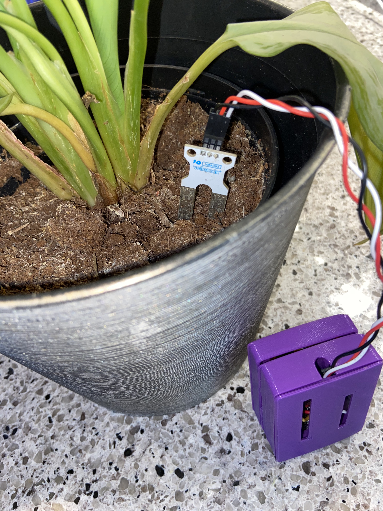
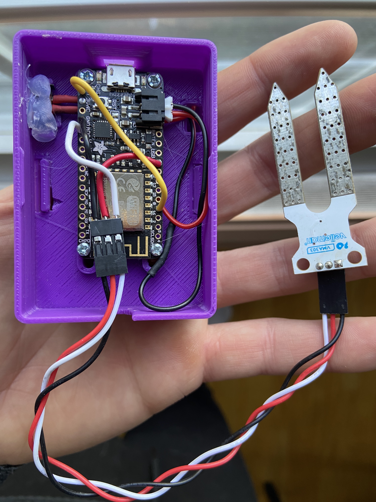

# Soil Moisture Sensor

## Problem

I keep forgetting to water my plants and don't know when to do so.

## Solution

Get a text alerting me when the moisture of my plant soil is low.

## How

1. [ESP8266 WiFi](https://www.ebay.com/itm/ESP8266-ESP-12E-WIFI-Microcontroller-USB-Development-Board-Arduino-MicroPython-/132532596045?var=0&mkevt=1&mkcid=1&mkrid=711-53200-19255-0&campid=5338590836&toolid=10044&customid=449f17358cc11656d8657776624d2598) controller performs moisture sample every X/minutes

2. Sample data is uploaded to cloud function via HTTP request

3. Cloud function compares sample data to set threshold

4. If lower, send a request to twilio to send SMS to set phone number

## Features

- Custom 3D printed case (Thank you [Watertown public library](https://www.watertownlib.org/hatch))
- 3.7v lithium rechargeable battery
